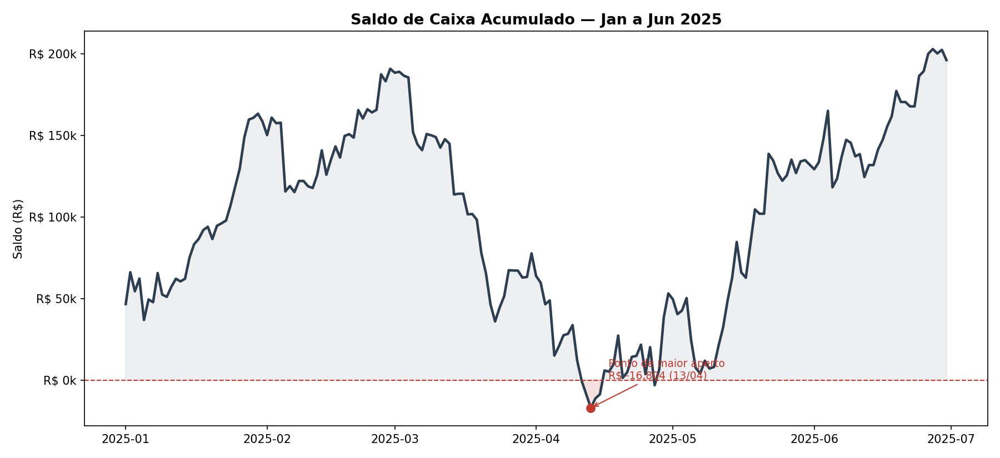
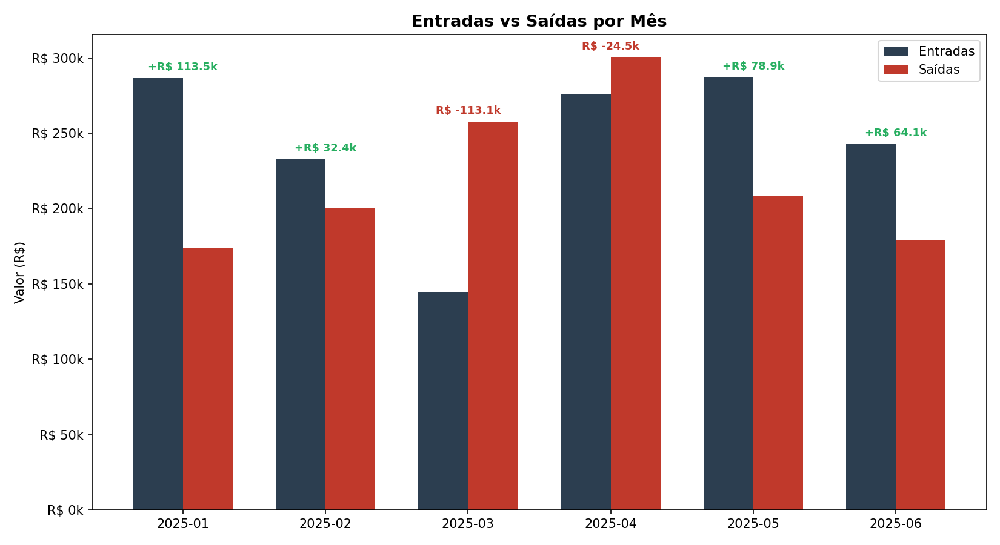
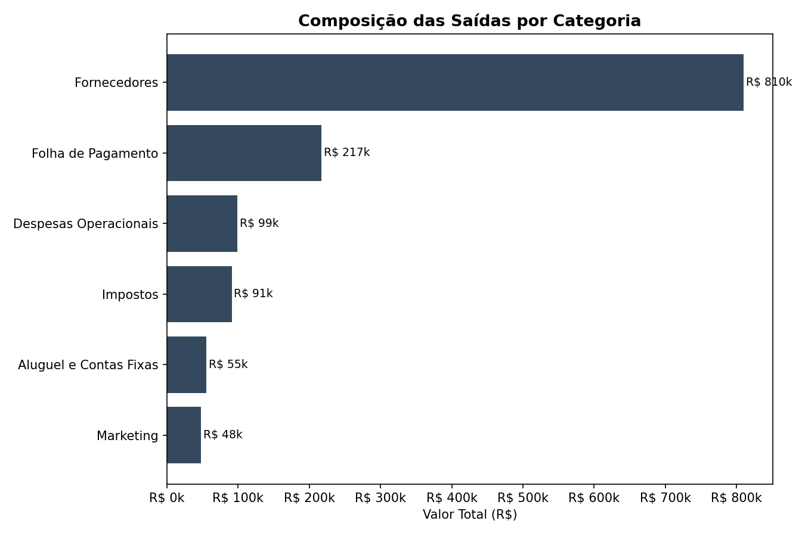

# Análise de Fluxo de Caixa — PME Fictícia

Análise de fluxo de caixa de 6 meses (jan-jun/2025) simulando o dia a dia financeiro de uma pequena empresa: entradas, saídas, saldo acumulado e identificação de pontos de risco de liquidez.

> **Nota:** os dados utilizados neste projeto são fictícios, criados para fins de demonstração. A estrutura e a lógica de análise são as mesmas aplicadas em contextos reais de gestão financeira.

## Problema de negócio

Fluxo de caixa é, na prática, a informação mais crítica pra sobrevivência de uma PME — mais até do que lucro no papel. Uma empresa pode estar "lucrativa" no DRE e mesmo assim quebrar por falta de caixa no momento certo.

Este projeto responde três perguntas que qualquer gestor financeiro precisa monitorar:
1. Qual é o saldo de caixa projetado dia a dia, e existe risco de ficar no vermelho?
2. Como entradas e saídas se comportam mês a mês — a empresa está gerando caixa ou consumindo?
3. Onde está concentrado o gasto, e o que pode ser renegociado ou cortado?

## O que foi feito

- **Saldo de caixa acumulado**: simulação dia a dia do saldo, partindo de um saldo inicial, somando entradas e subtraindo saídas — a métrica mais importante pra antecipar problemas de liquidez
- **Entradas vs. saídas por mês**: comparação mensal pra identificar em que meses a operação gerou ou consumiu caixa
- **Composição das saídas**: quebra por categoria (fornecedores, folha, impostos, aluguel, marketing, operacional) pra apontar onde está o maior peso de custo

## Resultados

### Saldo de Caixa Acumulado



**Insight principal:** apesar do crescimento no fechamento do período (saldo saiu de R$ 45 mil pra quase R$ 200 mil), houve um **ponto real de aperto entre março e abril**, quando o saldo chegou a ficar negativo. A causa: queda sazonal de vendas em março combinada com o pagamento de imposto trimestral e uma despesa extraordinária de manutenção. Sem visibilidade antecipada desse tipo de cenário, a empresa corre risco de não conseguir honrar compromissos no momento certo — é exatamente esse tipo de alerta que um dashboard de fluxo de caixa precisa entregar com antecedência.

### Entradas vs Saídas por Mês



Março foi o único mês com resultado líquido fortemente negativo (-R$ 113 mil), refletindo a queda de vendas e a concentração de saídas naquele período. Abril ainda sentiu o reflexo antes da recuperação em maio e junho.

### Composição das Saídas



**Fornecedores concentram 61% de todas as saídas do período** — o maior alavancador de negociação pra melhorar o caixa da empresa seria renegociar prazo ou condições com os principais fornecedores, não cortar despesas operacionais menores.

## Ferramentas utilizadas

- **Python** (pandas, matplotlib) para tratamento de dados, cálculo de saldo acumulado e visualização
- Lógica replicável em **Power BI** (medida DAX de saldo acumulado com `CALCULATE` + `FILTER`, gráfico de área combinado com linha de referência zero)

## Estrutura do repositório

```
├── dados/              → dataset de lançamentos, saldo diário e resumo mensal
├── notebook/           → scripts de geração de dados e análise
├── imagens/            → gráficos gerados
└── README.md
```

## Sobre

Projeto de portfólio desenvolvido por Natalia Pusebon — Analista de Finanças com experiência em Power BI, Excel e análise de dados financeiros.
